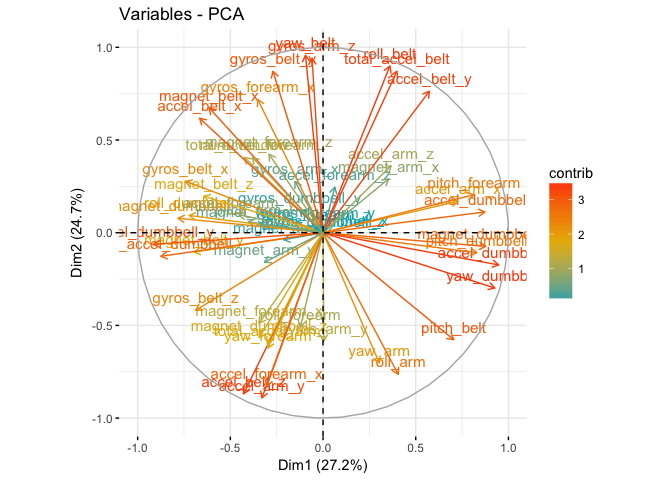
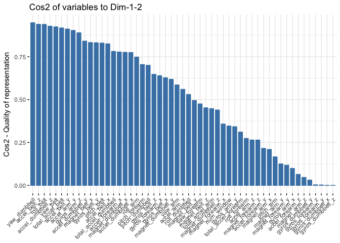
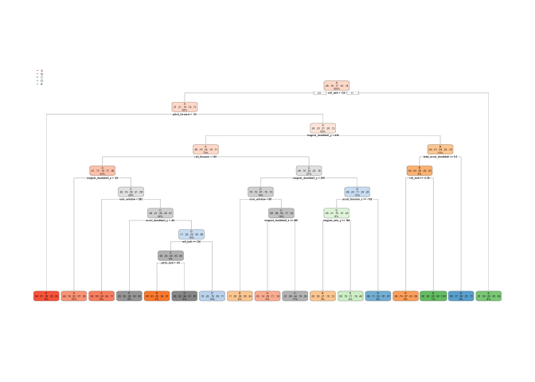

## 1.0 Executive Summary

Using devices such as Jawbone Up, Nike FuelBand, and Fitbit it is now possible to collect a large amount of data about personal activity relatively inexpensively. These type of devices are part of the quantified self movement – a group of enthusiasts who take measurements about themselves regularly to improve their health, to find patterns in their behavior, or because they are tech geeks. One thing that people regularly do is quantify how much of a particular activity they do, but they rarely quantify how well they do it. In this project, your goal will be to use data from accelerometers on the belt, forearm, arm, and dumbell of 6 participants. They were asked to perform barbell lifts correctly and incorrectly in 5 different ways. 

Specifically, the 6 participants model were asked to perform one set of 10 repetitions of the Unilateral Dumbbell Biceps Curl in five different fashions: 

- exactly according to the specification (Class A)
- throwing the elbows to the front (Class B)
- lifting the dumbbell only halfway (Class C)
- lowering the dumbbell only halfway (Class D) 
- throwing the hips to the front (Class E)

Read more: http://groupware.les.inf.puc-rio.br/har#ixzz5FoxOEpS8

Data ref: Ugulino, W.; Cardador, D.; Vega, K.; Velloso, E.; Milidiu, R.; Fuks, H. Wearable Computing: Accelerometers' Data Classification of Body Postures and Movements. Proceedings of 21st Brazilian Symposium on Artificial Intelligence. Advances in Artificial Intelligence - SBIA 2012. In: Lecture Notes in Computer Science. , pp. 52-61. Curitiba, PR: Springer Berlin / Heidelberg, 2012. ISBN 978-3-642-34458-9. DOI: 10.1007/978-3-642-34459-6_6.

Read more: http://groupware.les.inf.puc-rio.br/har#ixzz5FjDAtpyh

### 1.1 Goal
The goal of the project is to predict the manner in which they did the exercise. This is the "classe" variable in the training set. You may use any of the other variables to predict with. You should create a report describing how you built your model, how you used cross validation, what you think the expected out of sample error is, and why you made the choices you did. You will also use your prediction model to predict 20 different test cases.

### 1.2 Approach
We have started by citing the problem in the Executive Summary and Goal, and we will follow a process that includes the following steps:

1. Prepare, Transform the data and select the most appropriate predictors
2. Perform exploratory data anlysis
3. Traing a model on the data
4. Validate the model performance
5. Improve model performance
6. Validation of best performing model

Each step will have it's own section and related supportive arguments for the select approach. The above approach is referenced in: Lantz, B. (2015). Machine Learning with R. Birmingham, UK: Packt.

***

## 2.0 Prepare and Transform the Data
Best practices in data preparation usually takes up most of the time followed by creating the model and then reporting. There are many approaches that dictate how we should try to reduce the time taken for data preparation which we can use for creating and testing the model. However, a model is only as good as the data on which it is created. A simpler model based on clean data will most likely outperform a complicated model based on dirty or ambiguous data. Ref. Romeo, V. (2016). Preparing the data for modelling with R.

In this section we will download the data, clean the data, partition it for traing and testing modeling runs.

### 2.1 Download the Data

```r
# Training Data download
trainingdatafile <- "pml-training.csv"
fileUrl <- "https://d396qusza40orc.cloudfront.net/predmachlearn/pml-training.csv"
download.file(fileUrl, destfile = trainingdatafile, method = "curl")
trainingdata = read.csv("pml-training.csv", header = TRUE, sep = ",")

# Testing Data download
testingdatafile <- "pml-testing.csv"
fileUrl <- "https://d396qusza40orc.cloudfront.net/predmachlearn/pml-testing.csv"
download.file(fileUrl, destfile = testingdatafile, method = "curl")
testingdata = read.csv("pml-testing.csv", header = TRUE, sep = ",")
```

### 2.2 Partition the training set

```r
in_train  <- createDataPartition(trainingdata$classe, p=0.75, list=FALSE)
train_set <- trainingdata[ in_train, ]  # Results in 14,718 rows and 160 columns
dim(train_set)
```

```
## [1] 14718   160
```

```r
test_set  <- trainingdata[-in_train, ]  # Results in 4904 rows and 160 columns
#### Here are the orignial dimensions of test_set
dim(test_set)
```

```
## [1] 4904  160
```

### 2.3 Remove all Near Zero Variance (NZV) from the Training and Testing Sets
Here we remove all inconseqential values that will result in needless noise for our models.

```r
nzv_var <- nearZeroVar(train_set)   # creates index of all columns (variables) with NZV
train_set <- train_set[ , -nzv_var] # removes all columns (variables) with NZV - results in 14,718 rows and 102 columns
dim(train_set)
```

```
## [1] 14718   104
```

```r
test_set  <- test_set [ , -nzv_var] # removes all columns (variables) with NZV - results in 4904 rows and 102 columns
#### Here are the dimensions of the test_set after NZV are removed
dim(test_set)
```

```
## [1] 4904  104
```

### 2.4 Remove all NA Variables
Here we remove all NA values from the data set.

```r
na_var <- sapply(train_set, function(x) mean(is.na(x))) > 0.95  # creates an index of all NA variables with a 95% treshold
train_set <- train_set[ , na_var == FALSE] # removes all columns (variables) with NAs - results in 14,718 rows and 59 columns
dim(train_set)
```

```
## [1] 14718    59
```

```r
test_set  <- test_set [ , na_var == FALSE] # removes all columns (variables) with NAs - results in 4904 rows and 59 columns
#### Here are the dimensions of the test_set after NAs are removed
dim(test_set)
```

```
## [1] 4904   59
```

### 2.5 Remove other uneeded columns (variables)
Here we remove all other identifiable information not required in the modeling.

```r
train_set <- train_set[ , -(1:5)]
test_set  <- test_set [ , -(1:5)]
```

### 2.6 Multithread for improved processing performance

```r
h2o.init(nthreads = 8)
```

```
##  Connection successful!
## 
## R is connected to the H2O cluster: 
##     H2O cluster uptime:         4 hours 33 minutes 
##     H2O cluster timezone:       America/Los_Angeles 
##     H2O data parsing timezone:  UTC 
##     H2O cluster version:        3.18.0.8 
##     H2O cluster version age:    29 days  
##     H2O cluster name:           H2O_started_from_R_josepi_huk890 
##     H2O cluster total nodes:    1 
##     H2O cluster total memory:   3.36 GB 
##     H2O cluster total cores:    8 
##     H2O cluster allowed cores:  8 
##     H2O cluster healthy:        TRUE 
##     H2O Connection ip:          localhost 
##     H2O Connection port:        54321 
##     H2O Connection proxy:       NA 
##     H2O Internal Security:      FALSE 
##     H2O API Extensions:         XGBoost, Algos, AutoML, Core V3, Core V4 
##     R Version:                  R version 3.4.3 (2017-11-30)
```

***

## 3.0 Perform exploratory data analysis
Here we use the principal component analysis approach to show the relationships between all variables.

### 3.1 Correlation - variable correlation plot

```r
correlations <- cor(train_set[ , -54])
# corrplot(correlations, order = "hclust", tl.cex = 0.6, tl.col = rgb(0, 0, 0))
pca1 = prcomp(correlations, scale. = TRUE)
fviz_pca_var(pca1, col.var = "contrib",
             gradient.cols = c("#00AFBB", "#E7B800", "#FC4E07")
             )
```

<!-- -->

The plot can be interpreted as follow:

Positively correlated variables are grouped together.
Negatively correlated variables are positioned on opposite sides of the plot origin (opposed quadrants).
The distance between variables and the origin measures the quality of the variables on the factor map. Variables that are away from the origin are well represented on the factor map.

- A high cos2 indicates a good representation of the variable on the principal component. In this case the variable is positioned close to the circumference of the correlation circle.

- A low cos2 indicates that the variable is not perfectly represented by the PCs. In this case the variable is close to the center of the circle. (ref: Kassambara, Articles - Principal Component Methods in R: Practical Guide)

### 3.2 Correlation - Cos2 Representation of Variable on the PCA

```r
fviz_cos2(pca1, choice = "var", axes = 1:2)
```

<!-- -->


For a given variable, the sum of the cos2 on all the principal components is equal to one.

If a variable is perfectly represented by only two principal components (Dim.1 & Dim.2), the sum of the cos2 on these two PCs is equal to one. In this case the variables will be positioned on the circle of correlations.

For some of the variables, more than 2 components might be required to perfectly represent the data. In this case the variables are positioned inside the circle of correlations. (ref: Kassambara, Articles - Principal Component Methods in R: Practical Guide)

***

## 4.0 Train a Model on the data
In this section we will build several models using various algorithms to discern the best predictive model for the personal activity data in the training data set.

### 4.1 Decision Tree Model

```r
set.seed(123)

fit_train_tree <- rpart(classe ~ ., data = train_set, method = "class")

# Print and Plot the tree - version 1
#printcp(fit_train_tree) # display the results 
#plotcp(fit_train_tree) # visualize cross-validation results 
# summary(fit_train_tree$finalModel) # detailed summary of splits

# Plot the tree - version 2
rpart.plot(fit_train_tree)
```

<!-- -->


***

## 5.0 Validate the model performance
We used given our type of data, we used some of the recommended model by Lantz, B. In this section used a Decision Tree Model, a Generalized Boosted Model and a Random Forest models approach to validate models and performance.  


### 5.1 Run a Confusion Matrix to Validate Accuracy of the Decision Tree Model

```r
predict_decision_tree <- predict(fit_train_tree, newdata = test_set, type="class")
conf_matrix_decision_tree <- confusionMatrix(predict_decision_tree, test_set$classe)
conf_matrix_decision_tree
```

```
## Confusion Matrix and Statistics
## 
##           Reference
## Prediction    A    B    C    D    E
##          A 1212  186   19   75   94
##          B   32  480   60   32   75
##          C   10   54  642  143   62
##          D  123  205  112  526  104
##          E   18   24   22   28  566
## 
## Overall Statistics
##                                           
##                Accuracy : 0.6986          
##                  95% CI : (0.6856, 0.7114)
##     No Information Rate : 0.2845          
##     P-Value [Acc > NIR] : < 2.2e-16       
##                                           
##                   Kappa : 0.6177          
##  Mcnemar's Test P-Value : < 2.2e-16       
## 
## Statistics by Class:
## 
##                      Class: A Class: B Class: C Class: D Class: E
## Sensitivity            0.8688  0.50580   0.7509   0.6542   0.6282
## Specificity            0.8934  0.94968   0.9336   0.8673   0.9770
## Pos Pred Value         0.7642  0.70692   0.7047   0.4916   0.8602
## Neg Pred Value         0.9448  0.88899   0.9467   0.9275   0.9211
## Prevalence             0.2845  0.19352   0.1743   0.1639   0.1837
## Detection Rate         0.2471  0.09788   0.1309   0.1073   0.1154
## Detection Prevalence   0.3234  0.13846   0.1858   0.2182   0.1342
## Balanced Accuracy      0.8811  0.72774   0.8422   0.7608   0.8026
```

### 5.2 Run a Generalized Boosted Model

```r
set.seed(123)
ctrl_GBM <- trainControl(method = "repeatedcv", number = 2, repeats = 2)
fit_GBM  <- train(classe ~ ., data = train_set, method = "gbm",
                  trControl = ctrl_GBM, verbose = FALSE)
fit_GBM$finalModel
```

```
## A gradient boosted model with multinomial loss function.
## 150 iterations were performed.
## There were 53 predictors of which 43 had non-zero influence.
```

#### 5.2.1 Validate Accuracy of GBM Model

```r
predict_GBM <- predict(fit_GBM, newdata = test_set)
conf_matrix_GBM <- confusionMatrix(predict_GBM, test_set$classe)
conf_matrix_GBM
```

```
## Confusion Matrix and Statistics
## 
##           Reference
## Prediction    A    B    C    D    E
##          A 1394   10    0    0    0
##          B    1  931    7    3    7
##          C    0    8  846   10    2
##          D    0    0    2  788    6
##          E    0    0    0    3  886
## 
## Overall Statistics
##                                           
##                Accuracy : 0.988           
##                  95% CI : (0.9845, 0.9908)
##     No Information Rate : 0.2845          
##     P-Value [Acc > NIR] : < 2.2e-16       
##                                           
##                   Kappa : 0.9848          
##  Mcnemar's Test P-Value : NA              
## 
## Statistics by Class:
## 
##                      Class: A Class: B Class: C Class: D Class: E
## Sensitivity            0.9993   0.9810   0.9895   0.9801   0.9834
## Specificity            0.9972   0.9954   0.9951   0.9980   0.9993
## Pos Pred Value         0.9929   0.9810   0.9769   0.9899   0.9966
## Neg Pred Value         0.9997   0.9954   0.9978   0.9961   0.9963
## Prevalence             0.2845   0.1935   0.1743   0.1639   0.1837
## Detection Rate         0.2843   0.1898   0.1725   0.1607   0.1807
## Detection Prevalence   0.2863   0.1935   0.1766   0.1623   0.1813
## Balanced Accuracy      0.9982   0.9882   0.9923   0.9891   0.9913
```


## 5.3 Run a Random Forest Model

```r
set.seed(123)
ctrl_RF <- trainControl(method = "repeatedcv", number = 2, repeats = 2)
fit_RF  <- train(classe ~ ., data = train_set, method = "rf",
                  trControl = ctrl_RF, verbose = FALSE)
fit_RF$finalModel
```

```
## 
## Call:
##  randomForest(x = x, y = y, mtry = param$mtry, verbose = FALSE) 
##                Type of random forest: classification
##                      Number of trees: 500
## No. of variables tried at each split: 27
## 
##         OOB estimate of  error rate: 0.14%
## Confusion matrix:
##      A    B    C    D    E  class.error
## A 4184    0    0    0    1 0.0002389486
## B    2 2843    2    1    0 0.0017556180
## C    0    3 2563    1    0 0.0015582392
## D    0    0    8 2403    1 0.0037313433
## E    0    0    0    2 2704 0.0007390983
```

### 5.3.1 Validate the Accuracy of the Random Forest Model

```r
predict_RF <- predict(fit_RF, newdata = test_set)
conf_matrix_RF <- confusionMatrix(predict_RF, test_set$classe)
conf_matrix_RF
```

```
## Confusion Matrix and Statistics
## 
##           Reference
## Prediction    A    B    C    D    E
##          A 1394    3    0    0    0
##          B    1  945    5    0    0
##          C    0    1  850    4    0
##          D    0    0    0  800    0
##          E    0    0    0    0  901
## 
## Overall Statistics
##                                           
##                Accuracy : 0.9971          
##                  95% CI : (0.9952, 0.9984)
##     No Information Rate : 0.2845          
##     P-Value [Acc > NIR] : < 2.2e-16       
##                                           
##                   Kappa : 0.9964          
##  Mcnemar's Test P-Value : NA              
## 
## Statistics by Class:
## 
##                      Class: A Class: B Class: C Class: D Class: E
## Sensitivity            0.9993   0.9958   0.9942   0.9950   1.0000
## Specificity            0.9991   0.9985   0.9988   1.0000   1.0000
## Pos Pred Value         0.9979   0.9937   0.9942   1.0000   1.0000
## Neg Pred Value         0.9997   0.9990   0.9988   0.9990   1.0000
## Prevalence             0.2845   0.1935   0.1743   0.1639   0.1837
## Detection Rate         0.2843   0.1927   0.1733   0.1631   0.1837
## Detection Prevalence   0.2849   0.1939   0.1743   0.1631   0.1837
## Balanced Accuracy      0.9992   0.9971   0.9965   0.9975   1.0000
```


***

### 6.0 Improve Model Performance
We used a fine tunning approach referenced by Lantz, B., for Random Forest and C5.0 models, to obtain the highest performace from each approach.

#### 6.1 Random Forest Model Performance

```r
grid_rf <- expand.grid(.mtry = c(2,4,8,16))
set.seed(123)
m_rf <- train(classe ~ ., data = train_set, method = "rf",
                  metric = "Kappa", trControl = ctrl_RF, tuneGrid = grid_rf)

m_rf
```

```
## Random Forest 
## 
## 14718 samples
##    53 predictor
##     5 classes: 'A', 'B', 'C', 'D', 'E' 
## 
## No pre-processing
## Resampling: Cross-Validated (2 fold, repeated 2 times) 
## Summary of sample sizes: 7359, 7359, 7358, 7360 
## Resampling results across tuning parameters:
## 
##   mtry  Accuracy   Kappa    
##    2    0.9887213  0.9857311
##    4    0.9918127  0.9896430
##    8    0.9941228  0.9925658
##   16    0.9949042  0.9935542
## 
## Kappa was used to select the optimal model using the largest value.
## The final value used for the model was mtry = 16.
```


#### 6.2 C5.0 Decision Tree Performance

```r
grid_dtm <- expand.grid(.model = "tree",
                        .trials = c(10, 20, 30, 40),
                        .winnow = "FALSE")
set.seed(123)
m_dtm <- train(classe ~ ., data = train_set, method = "C5.0",
                  metric = "Kappa", trControl = ctrl_RF, tuneGrid = grid_dtm)
m_dtm
```

```
## C5.0 
## 
## 14718 samples
##    53 predictor
##     5 classes: 'A', 'B', 'C', 'D', 'E' 
## 
## No pre-processing
## Resampling: Cross-Validated (2 fold, repeated 2 times) 
## Summary of sample sizes: 7359, 7359, 7358, 7360 
## Resampling results across tuning parameters:
## 
##   trials  Accuracy   Kappa    
##   10      0.9937151  0.9920499
##   20      0.9954478  0.9942415
##   30      0.9958894  0.9948003
##   40      0.9960933  0.9950582
## 
## Tuning parameter 'model' was held constant at a value of tree
## 
## Tuning parameter 'winnow' was held constant at a value of FALSE
## Kappa was used to select the optimal model using the largest value.
## The final values used for the model were trials = 40, model = tree
##  and winnow = FALSE.
```


***

## 7.0 Observations and Application of Test Model
### 7.1 Summary
Initially, the model with the most accurate predicitive capability resulted in the **Random Forest** method as summarized below:

Method                |  Accuracy
--------------------- | ------------
Random Forest         | **99.8%**
Decision Tree         | **98.5%**
Generalize Boosting   | **73.5%**

However, after fine tuning the Random Forest and a C5.0 Decision Tree model, the C5.0 Decision Tree model provides the best accuracy and Kappa values as summarized below:

Method                |  Accuracy    | Kappa
--------------------- | ------------ | ----------
Random Forest         | **99.3%**    | **.991** 
C5.0 Decision Tree    | **99.5%**    | **.993**


### 7.2 Application of Best Model to Testing Data Set
Here we apply the C5.0 Decision Tree Model to our **testingdata** set for validation with 20 test cases.

```r
predictionresult <- predict(m_dtm, newdata = testingdata)
predictionresult
```

```
##  [1] B A B A A E D B A A B C B A E E A B B B
## Levels: A B C D E
```

### 7.3 Expected out-of-sample error
Our approach for error sampling includes the testing with 21 observations from the **test_set**, using the predictions from the C5.0 Decision Tree and Random Forest models. 

```r
# Out of Sample Prediction
predicted <- predict(m_dtm, test_set[100:120, ], type = "prob")
predicted2 <- predict(m_rf, test_set[100:120, ], type = "prob")

# Evaluate Error
outofsample <- sqrt(mean((predicted - predicted2)^2))
```

Our model indicates an out-of-sample error of 0.0210116, and as a result very few, or none, of the test samples will be missclassified.

***

## 8.0 References

1. Lantz, B. (2015). Machine Learning with R. Birmingham, UK: Packt.
2. Kuhn, M., Johnson, K. (2016). Applied Predictive Modeling. Groton, Conneticut: Springer.
3. Ugulino, W.; Cardador, D.; Vega, K.; Velloso, E.; Milidiu, R.; Fuks, H. Wearable Computing: Accelerometers' Data Classification of Body Postures and Movements. Proceedings of 21st Brazilian Symposium on Artificial Intelligence. Advances in Artificial Intelligence - SBIA 2012. In: Lecture Notes in Computer Science. , pp. 52-61. Curitiba, PR: Springer Berlin / Heidelberg, 2012. ISBN 978-3-642-34458-9. DOI: 10.1007/978-3-642-34459-6_6.
4. Romeo, V. (2016). Preparing the data for modelling with R. Retrieved from: https://www.r-bloggers.com/preparing-the-data-for-modelling-with-r/ on 5/17/2018
5. Kassambara, Articles - Principal Component Methods in R: Practical Guide. Statistical Tools for high-throughput data analysis. Retrieved from: http://www.sthda.com/english/articles/31-principal-component-methods-in-r-practical-guide/112-pca-principal-component-analysis-essentials/ on 5/19/2018

